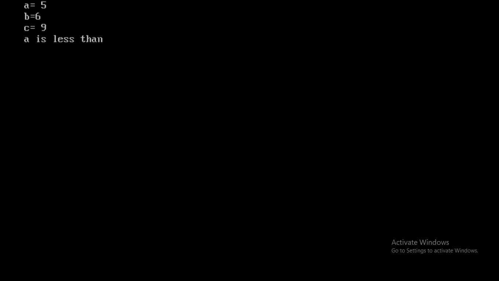

# Find-Greater-one
This is simple 'c' program which find greater number 
🔢 Find Greater Number (C Language)

📌 Overview

This project is a simple C program that takes two or more numbers as input and finds the greatest (largest) number among them.

---

🚀 Features

- 🔢 Compare two numbers
- 🔢 Compare three numbers
- ⚡ Fast and simple logic
- 🧠 Beginner-friendly program

---

🛠️ Technologies Used

- Language: C
- Concepts: Conditional Statements ("if-else")

---

📂 Project Structure

Find-Greater-Number/
│── greater.c
│── README.md

---

▶️ How to Run

1. Install a C compiler (GCC / Turbo C++)
2. Open terminal / command prompt
3. Compile the program:

gcc greater.c -o greater

4. Run the program:

./greater

---

🧠 Program Logic

- Take input from the user
- Use "if-else" conditions to compare numbers
- Display the greatest number

---

💻 Sample Code

#include <stdio.h>

int main() {
    int a, b;
    
    printf("Enter two numbers: ");
    scanf("%d %d", &a, &b);

    if(a > b) {
        printf("Greatest number is: %d", a);
    } else {
        printf("Greatest number is: %d", b);
    }

    return 0;
}

---

📸 Output Example

Enter two numbers: 10 25
Greatest number is: 25

---

🎯 Future Improvements

- Compare more than three numbers
- Add user-friendly menu
- Handle invalid inputs

---

👨‍💻 Author

- Khushi Jaiswal

---

📜 License

This project is for educational purposes only.
-----
##runpage

